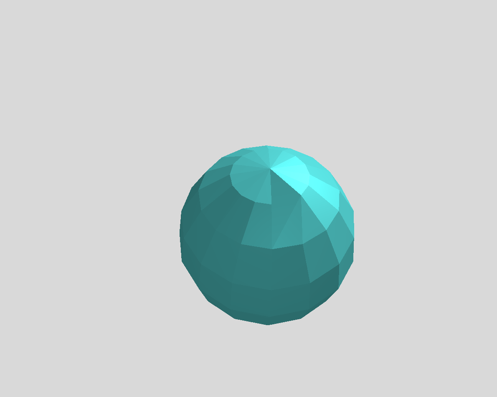

# Garland Mesh Simplification

## Report

Both Part 1 and Part 2 are working!

I have screenshots of my results labelled and included in the `screenshots` folder. Those screenshots are also displayed in this Markdown file.

## Results

### Part 1

Removing vertices and collapsing edges works well on the sphere.

After removing 1 vertex...

 

After removing 2 vertices...

 

After removing 3 vertices...

 

After collapsing 1 edge...

 

After collapsing 2 edges...

 

After collapsing 3 edges...

 

### Part 2

Running Garland's method of mesh simplification on the sphere (with **stopping ratio of 0.5**) yields good results.

 

However, running mesh simplification on the Stanford bunny (with a **stopping ratio of 0.005**) seems to deform the mesh quite a bit.

 

With a higher stopping ratio--like 0.05--the bunny keeps its shape well.

 

## Usage

Before running the program, edit `build.xml` to specify what .obj file to load and what stopping ratio to use for simplification.

```sh
// Build and execute the program
$ ant
```

## Controls

| Key              | Action                                                    |
|------------------|-----------------------------------------------------------|
| X                | Simplify the mesh                                         |
| N                | Remove a vertex                                           |
| M                | Collapse an edge                                          |
| Z                | Toggle wireframe mesh                                     |
| D                | Enable debug mode (displays MAC grid and cell velocities) |
| U                | Translate current GameObject up                           |
| I                | Translate current GameObject down                         |
| O                | Translate current GameObject forward                      |
| P                | Translate current GameObject backward                     |
| A                | Rotate current GameObject positively about the x-axis     |
| S                | Rotate current GameObject negatively about the x-axis     |
| D                | Rotate current GameObject positively about the y-axis     |
| F                | Rotate current GameObject negatively about the y-axis     |
| G                | Rotate current GameObject positively about the z-axis     |
| H                | Rotate current GameObject negatively about the z-axis     |
| 1                | Take a screenshot                                         |

